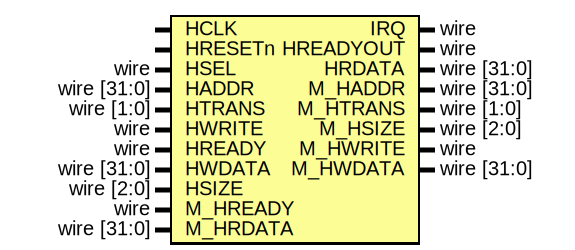

# MS_DMAC_AHBL
Direct Memory Access Controller (DMAC) with AHB-lite bus interface.

## Interfaces

## Ports

| Port name | Direction | Type        | Description |
| --------- | --------- | ----------- | ----------- |
| HCLK      | input     |             | System Clock            |
| HRESETn   | input     |             | System Reset            |
| IRQ       | output    | wire        | IRQ line to the CPU           |
| PIRQ       | intput    | wire        | IRQ lines from peripherals requesting data transfer |
| HSEL      | input     | wire        | Slave Port HSEL       |
| HADDR     | input     | wire [31:0] | Slave Port HADDR      |
| HTRANS    | input     | wire [1:0]  | Slave Port HTRANS     |
| HWRITE    | input     | wire        | Slave Port HWRITE     |
| HREADY    | input     | wire        | Slave Port HREADY     |
| HWDATA    | input     | wire [31:0] | Slave Port HWDATA     |
| HSIZE     | input     | wire [2:0]  | Slave Port HSIZE      |
| HREADYOUT | output    | wire        | Slave Port HREADYOUT  |
| HRDATA    | output    | wire [31:0] | Slave Port HRDATA     |
| M_HADDR   | output    | wire [31:0] | Master Port HADDR     |
| M_HTRANS  | output    | wire [1:0]  | Master Port HTRANS    |
| M_HSIZE   | output    | wire [2:0]  | Master Port HSIZE     |
| M_HWRITE  | output    | wire        | Master Port HWRITE    |
| M_HWDATA  | output    | wire [31:0] | Master Port HWDATA    |
| M_HREADY  | input     | wire        | Master Port HREADY    |
| M_HRDATA  | input     | wire [31:0] | Master Port HRDATA    |

## Slave Registers
| Address | Description |
| --------- | --------- |
|``0x00`` |Control Register  ``0: EN `` ``8-11: Transfer trigger; One bit for each of the 4 sources; 0000 means software trigger``  ``16-17: Source data type; 0: byte, 1: half word, 2: word``  ``18-20: Source Address Auto increment with value (0, 1, 2, or 4)``  ``24-25: Destination data type; 0: byte, 1: half word, 2: word``  ``26-28: Destination Address Auto increment with value (0, 1, 2, or 4)`` |
|``0x04`` |Status Register  ``0: Done`` |
|``0x08`` |Source Address Register |
|``0x0C`` |Destination Address Register |
|``0x10`` |Data Size Register |
|``0x14`` |SW Trigger Register|
|``0x18`` |Frame Count Register|

